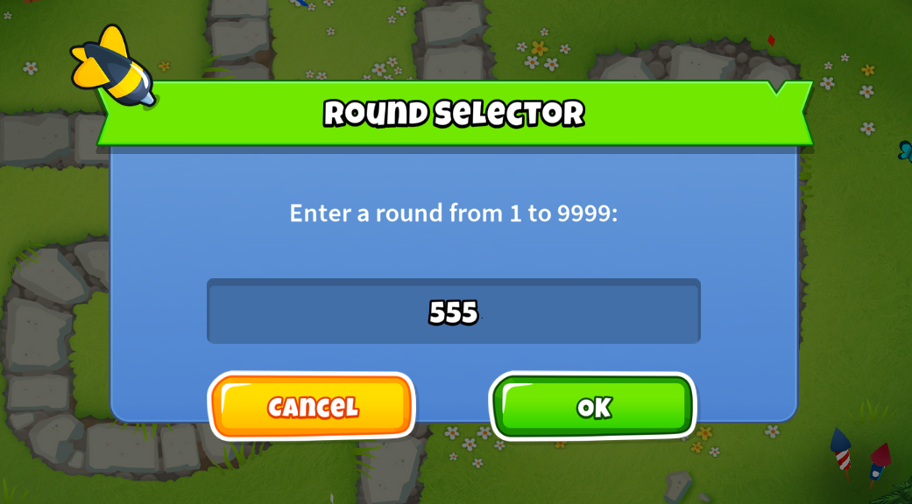

# Round Selector

A lightweight **Bloons TD 6 mod** that lets you jump directly to a selected round during a match.

Press **J**, enter any round from **1 to 9999**, and confirm. Round Selector then updates the active game to the chosen round.

> Designed for strategy testing, late-game experiments, challenge creation, and quickly testing specific rounds.

## Preview




## Features

* Jump directly to rounds **1–9999**
* Simple in-game round selection popup
* Press **J** to open the selector
* Numeric input validation
* Uses the BTD6 game bridge to update the active round
* Verifies that the selected round was applied
* Lightweight and open source

## Installation

### Requirements

You need:

* Bloons TD 6
* MelonLoader
* BTD Mod Helper

### Steps

1. Install MelonLoader for Bloons TD 6.
2. Install the latest version of BTD Mod Helper.
3. Download `RoundSelector.dll` from the latest GitHub release.
4. Place `RoundSelector.dll` inside your BTD6 `Mods` folder.
5. Launch Bloons TD 6.

Your Mods folder will normally look similar to:

```text
BloonsTD6/
└── Mods/
    └── RoundSelector.dll
```

## Usage

1. Start a match.
2. Press **J**.
3. Enter a round number between **1 and 9999**.
4. Confirm the popup.
5. The game will jump to the selected round.

For example, entering:

```text
100
```

will move the match to displayed Round 100.

## Controls

| Key | Action                        |
| --- | ----------------------------- |
| `J` | Open the Round Selector popup |

## Download

Download the latest version from the repository’s Releases page:

[Download Round Selector](https://github.com/baconhairofficial/RoundSelector/releases/latest)

## Source Code

Round Selector is fully open source. You can inspect the code, build it yourself, report problems, or contribute improvements.

Repository:

[github.com/baconhairofficial/RoundSelector](https://github.com/baconhairofficial/RoundSelector)

## Troubleshooting

### Pressing J does nothing

Make sure:

* You are currently inside an active match.
* MelonLoader is installed correctly.
* BTD Mod Helper is installed.
* `RoundSelector.dll` is directly inside the `Mods` folder.
* The mod supports your current BTD6 version.

### The selected round does not load correctly

Some unusually high rounds may behave differently depending on the game mode, map, other installed mods, or the current BTD6 version.

Try testing the mod with other mods temporarily disabled.

### The mod stopped working after a BTD6 update

Large BTD6 updates can change internal game methods. Check the Releases page for an updated version and report the issue if no update is available.

## Reporting Bugs

When reporting a problem, include:

* Your BTD6 version
* Your Round Selector version
* Your BTD Mod Helper version
* The selected round
* Any MelonLoader console errors
* A list of other installed mods

You can report bugs through the repository’s Issues page:

[Report an issue](https://github.com/baconhairofficial/RoundSelector/issues)

## Building From Source

Clone the repository:

```bash
git clone https://github.com/baconhairofficial/RoundSelector.git
```

Open the project in your preferred C# development environment and configure the required BTD6, MelonLoader, and BTD Mod Helper references.

Build the project and place the generated `RoundSelector.dll` inside your BTD6 `Mods` folder.

## Responsible Use

Round Selector is intended for private testing, sandbox experimentation, and strategy development.

Avoid using gameplay-changing mods in public, competitive, ranked, or co-op environments where they could affect other players or progression systems.

## Credits

Created by [baconhairofficial](https://github.com/baconhairofficial).

Built using:

* MelonLoader
* BTD Mod Helper
* Bloons TD 6 modding APIs

## License

See the repository license file for information about using, modifying, and redistributing this project.
